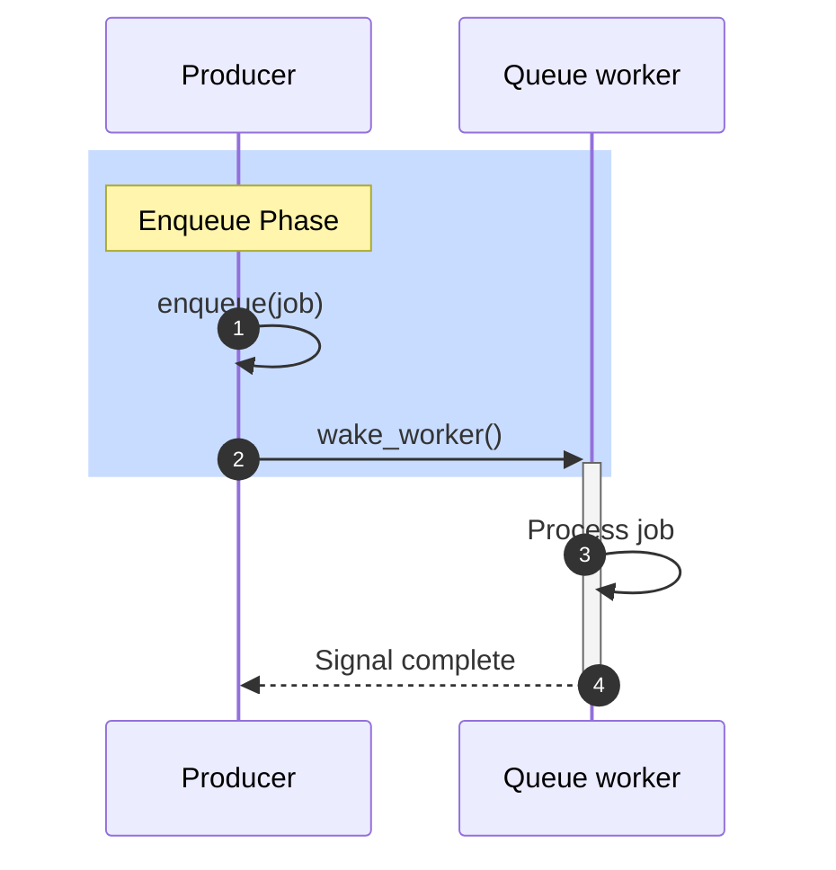
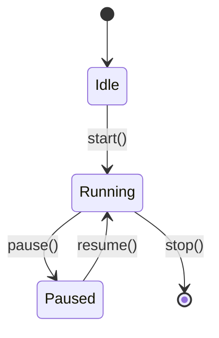

# Diagram Creation

## Format preference order — READ FIRST

When creating ANY structural diagram (architecture, block, flow, layered
system), follow this strict preference order:

1. **D2 with ELK layout engine + Roboto Mono** (FIRST choice)
   - Vector source, fine-grained styling, deterministic layout
   - Significantly more legible than Mermaid at typical column widths once
     font sizes are tuned
   - Render to both `.svg` (vector source of truth) and `.png` (predictable
     markdown rendering at 1600px wide via `rsvg-convert -w 1600`)
   - See [references/d2-diagrams.md](references/d2-diagrams.md) for the
     full setup, font choices, render recipe, and calibration story

2. **Non-Unicode ASCII** (SECOND choice)
   - Use only `+ - | < > / \ * =` characters — no `─ │ ┌ ┐ └ ┘ ▶` etc.
   - Best for plain-text docs, code comments, READMEs, and terminal output
     where images or Unicode may not render
   - Universally renderable in any text editor, diff tool, terminal
   - See [references/ascii-art.md](references/ascii-art.md)

3. **Mermaid** (LAST resort)
   - Use only when the rendering target speaks Mermaid and nothing else
     (e.g., a Confluence space without a D2 plugin, or a markdown viewer
     that can't display embedded images)
   - Layout is unpredictable, fonts not configurable, labels may truncate
   - See [references/mermaid-code-flow.md](references/mermaid-code-flow.md)

For data visualization (histograms, box plots, heat maps, geographic maps,
flame graphs), the format selection guide below still applies — D2 is for
*structural* diagrams, not data plots.

## Overview

This skill provides expertise in creating effective diagrams for documentation, research reports, and technical visualization. It covers multiple diagram formats (D2, ASCII art, Mermaid, Python/Graphviz) and helps select the appropriate format based on context and rendering requirements.

A picture speaks a thousand words.

## When to Use

Use this skill when you need to:
- Illustrate concepts, architectures, or system designs
- Create sequence diagrams for call flows or message passing
- Design flowcharts for algorithms or decision logic
- Build state machine diagrams for lifecycle transitions
- Generate data structure or memory layout diagrams
- Create timeline or event sequence visualizations
- Produce component relationship diagrams
- Visualize performance data with histograms, box plots, or scatter plots
- Generate heat maps for correlation or intensity analysis
- Create 3D surface plots for multi-variable relationships
- Produce flame graphs for CPU profiling visualization

## When NOT to Use

- Simple code-only explanations that don't benefit from visual aids
- Quick one-liner responses where text suffices
- When the user explicitly wants text-only output

## Format Selection Guide

Choose the diagram format based on rendering context and complexity:

| Context | Recommended Format | Reason |
|---------|-------------------|--------|
| **GitHub README/reports (architecture)** | **D2 (ELK + Roboto Mono) → SVG + PNG** | Best legibility at column width; vector source |
| **Research reports (.md, structural)** | **D2 → embed PNG, link SVG + .d2** | Calibrated for ~1000px markdown column |
| Plain-text docs / READMEs | ASCII art | Diff-friendly, universally renderable |
| Terminal/console output | ASCII art | Universal compatibility |
| Confluence / wiki without D2 plugin | Mermaid (last resort) | Only when D2 isn't supported |
| **HTML/Web output (interactive)** | **Bokeh** (preferred) | Interactive, browser-native |
| Static PNG/SVG images (charts) | Matplotlib | Print, documentation |
| **Geographic maps** | **Folium** | Real maps with Leaflet.js |
| Dependency graphs | D2 or Graphviz | D2 for layered, Graphviz for free graphs |
| Performance profiling | FlameGraph + perf | Interactive SVG stack traces |

**Library Selection for Python Visualizations:**

| Output Format | Preferred Library | Notes |
|---------------|-------------------|-------|
| HTML/Web | **Bokeh**, Plotly | Interactive, pan/zoom/hover |
| Static PNG/SVG | Matplotlib | Print, embedded images |
| Geographic | Folium | Real maps (not grids) |

**Note**: For plain-text docs, code comments, and diff-friendly output, use ASCII art only - no Unicode box drawing characters.

## Visualization Best Practices

### Less is More

- **Fewer relevant graphs > many redundant graphs**
- Each visualization should answer ONE specific question
- Remove elements that don't enhance understanding
- Consistent styling prevents confusion

### Avoid Redundancy

- Don't show the same data in multiple chart types
- Choose the ONE best representation for your data
- If a bar chart shows it clearly, don't also add a pie chart or table

### When to Create Multiple Graphs

- Different data sources (not same data, different views)
- Different time periods or comparisons
- Drill-down from summary to detail
- Genuinely different insights

### Anti-Patterns - What NOT to Do

| Anti-Pattern | Example | Better Approach |
|--------------|---------|-----------------|
| Redundant charts | Same latency as bar + pie + histogram | Pick ONE best representation |
| Grid maps | Square grid for US states | Use Folium with real geography |
| Too many charts | 10 charts showing minor metric variations | 2-3 charts with distinct insights |
| Matplotlib in HTML | PNG images in web reports | Use Bokeh for native HTML |

## Diagram Type Selection

| Diagram Type | Best For | Format | Reference |
|--------------|----------|--------|-----------|
| **Architecture / block** | **Layered systems, modules** | **D2 (ELK)** | [d2-diagrams.md](references/d2-diagrams.md) |
| Sequence | Code flow, API calls | D2 / ASCII (Mermaid as fallback) | [d2-diagrams.md](references/d2-diagrams.md) · [ascii-art.md](references/ascii-art.md) |
| State Machine | Lifecycles, events | D2 / ASCII (Mermaid as fallback) | [state-machines.md](references/state-machines.md) |
| Flowchart | Algorithms, decisions | D2 / ASCII | [d2-diagrams.md](references/d2-diagrams.md) |
| Class Diagram | Struct relationships | D2 (Mermaid as fallback) | [mermaid-code-flow.md](references/mermaid-code-flow.md#class-diagrams) |
| Data Structure | Memory layouts | ASCII | [ascii-art.md](references/ascii-art.md) |
| Timeline | Events, performance | ASCII | [ascii-art.md](references/ascii-art.md) |
| **Interactive Charts** | Web/HTML reports | **Bokeh** | [python-visualization.md](references/python-visualization.md#bokeh---interactive-web-visualizations-preferred-for-html) |
| **Geographic Map** | US/world maps | **Folium** | [python-visualization.md](references/python-visualization.md#folium---geographic-maps) |
| Histogram | Distributions | Bokeh/Matplotlib | [python-visualization.md](references/python-visualization.md) |
| Box Plot | Statistical comparison | Bokeh/Matplotlib | [python-visualization.md](references/python-visualization.md) |
| Heat Map | Correlation, intensity | Bokeh/Matplotlib | [python-visualization.md](references/python-visualization.md) |
| 3D Surface | Multi-variable analysis | Matplotlib | [python-visualization.md](references/python-visualization.md) |
| Flame Graph | CPU profiling | perf + FlameGraph | [python-visualization.md](references/python-visualization.md) |

## Quick Examples

### D2 Architecture Diagram (FIRST PREFERENCE)

```d2
vars: { d2-config: { layout-engine: elk } }
direction: down

classes: {
  hand:  { style: { font-size: 36; fill: "#ffffff"; stroke: "#444" } }
  gen:   { style: { font-size: 36; fill: "#fff3bf"; stroke: "#a37e00" } }
  group: { style: { font-size: 48; fill: "#fafafa"; stroke: "#222"; bold: true } }
}

client.class: group
client: "CLIENT" {
  app.class: hand
  app: "web app · CLI"
}

server.class: group
server: "SERVER" {
  api.class: gen
  api: "REST API\nhandler"
}

client -> server: "HTTPS" { style.font-size: 32; style.bold: true }
```

Render with:
```bash
REG=~/.local/share/fonts/RobotoMono-Regular.ttf
d2 --layout=elk --pad=30 --font-regular "$REG" diagram.d2 diagram.svg
rsvg-convert -w 1600 diagram.svg > diagram.png
```

See [references/d2-diagrams.md](references/d2-diagrams.md) for the full
recipe, font installation, calibration, and pitfalls.

### Mermaid Sequence Diagram (Code Flow — last-resort fallback)



See [references/mermaid-code-flow.md](references/mermaid-code-flow.md) for advanced patterns including trace annotations, conditional paths, and daemon loops.

### Mermaid State Machine (FSM)



See [references/state-machines.md](references/state-machines.md) for FSM patterns including progressive escalation, multi-flag encoding, and guard conditions.

### ASCII Art (Plain-Text Docs)

```
+----------------+        +----------------+
|   Component A  |------->|   Component B  |
+----------------+        +----------------+
```

See [references/ascii-art.md](references/ascii-art.md) for data structure layouts, timelines, and decision trees.

### Python Visualization (Bokeh for HTML)

```python
from bokeh.plotting import figure, save, output_file
from bokeh.models import HoverTool

output_file("/tmp/latency.html")
categories = ['Baseline', 'Opt-1', 'Opt-2']
values = [150, 95, 42]

p = figure(x_range=categories, height=400, title="Latency Comparison")
p.vbar(x=categories, top=values, width=0.8, color=['#ff6b6b', '#feca57', '#48dbfb'])
p.add_tools(HoverTool(tooltips=[("Latency", "@top us")]))
save(p)
```

See [references/python-visualization.md](references/python-visualization.md) for Bokeh, Folium maps, and Matplotlib examples.

## Related Tools

- **perf** + **FlameGraph**: generate flame graphs from CPU profiles
- **trace-cmd** / **ftrace**: event output can be visualized as timeline diagrams
- **bpftrace**: dynamic tracing produces data for behavior diagrams

## Best Practices

1. **Start simple**: Use ASCII art for quick drafts; upgrade to D2 for final versions in research reports.
2. **Prefer D2 over Mermaid**: D2 with ELK + Roboto Mono is significantly more legible than Mermaid at GitHub column widths once font sizes are tuned. Use Mermaid only when D2 isn't supported by the rendering target.
3. **Label everything**: Nodes, edges, and regions should have clear labels.
4. **Use consistent style**: Match existing diagram styles in the document. Use the standard D2 colour palette (`hand`/`gen`/`vendor`/`rust`/`hw`/`group`).
5. **Keep diagrams focused**: One concept per diagram; split complex diagrams. Don't put a legend inside a D2 diagram — use markdown text.
6. **Consider rendering context**: GitHub markdown columns are ~1000px wide; calibrate D2 font sizes accordingly (36pt body / 48pt title).
7. **Materialize PNG alongside SVG**: For markdown embedding, render the SVG to a fixed-width PNG (1600px) so display size is predictable.
8. **Test rendering**: Open the rendered PNG/SVG to verify legibility before committing.
9. **Add error handling**: When using Python scripts, wrap in try/except.

## Quick Reference

### Mermaid Cheat Sheet

```
sequenceDiagram    - For call flows (code flow)
graph TD/LR        - For flowcharts
stateDiagram-v2    - For state machines (FSM)
classDiagram       - For struct relationships
```

### ASCII Character Reference

```
Box corners:    + + + +
Horizontal:     - = _
Vertical:       |
Arrows:         -> <- v ^ --> <--
Connections:    / \
```

### Color Conventions (Mermaid)

| Color | RGB | Use For |
|-------|-----|---------|
| Blue | `rgb(200, 220, 255)` | Entry/enqueue phases |
| Green | `rgb(220, 255, 220)` | Processing phases |
| Yellow | `rgb(255, 255, 200)` | Wait/deferral periods |
| Orange | `rgb(255, 220, 200)` | Execution/completion |
| Red | `rgb(255, 200, 200)` | Interrupt/IPI events |

## Troubleshooting

### Mermaid Not Rendering

**Problem:** Mermaid diagram shows as code block.

**Solution:** Ensure code block uses ```mermaid, test in [Mermaid Live](https://mermaid.live/).

### ASCII Diagram Misaligned

**Problem:** Boxes don't line up.

**Solution:** Use monospace font, avoid tabs, keep lines under 80 characters.

### Graphviz Not Installed

```bash
sudo apt install graphviz
pip install graphviz matplotlib seaborn
```

### Installing Visualization Libraries

```bash
# Interactive web visualizations (preferred for HTML)
pip install bokeh

# Geographic maps
pip install folium geopandas

# Static visualizations (when HTML not needed)
pip install matplotlib seaborn

# Graph structures
pip install graphviz networkx scipy
```

## Resources

- [Mermaid Documentation](https://mermaid.js.org/)
- [Mermaid Live Editor](https://mermaid.live/)
- [ASCIIFlow](https://asciiflow.com/) - Interactive ASCII diagram editor
- [Graphviz Documentation](https://graphviz.org/documentation/)

## Reference Files

- [references/d2-diagrams.md](references/d2-diagrams.md) - **D2 with ELK + Roboto Mono** (first preference for architecture diagrams)
- [references/ascii-art.md](references/ascii-art.md) - **Non-Unicode ASCII** patterns for plain-text docs (second preference)
- [references/mermaid-code-flow.md](references/mermaid-code-flow.md) - Mermaid sequence diagrams, flowcharts (last-resort fallback)
- [references/state-machines.md](references/state-machines.md) - FSM patterns and design techniques
- [references/python-visualization.md](references/python-visualization.md) - Statistical charts and Python examples

## Related Tools

- **perf**: CPU profiling and flame graph generation
- **trace-cmd** / **ftrace**: event tracing visualization
- **bpftrace**: dynamic tracing data for diagrams
