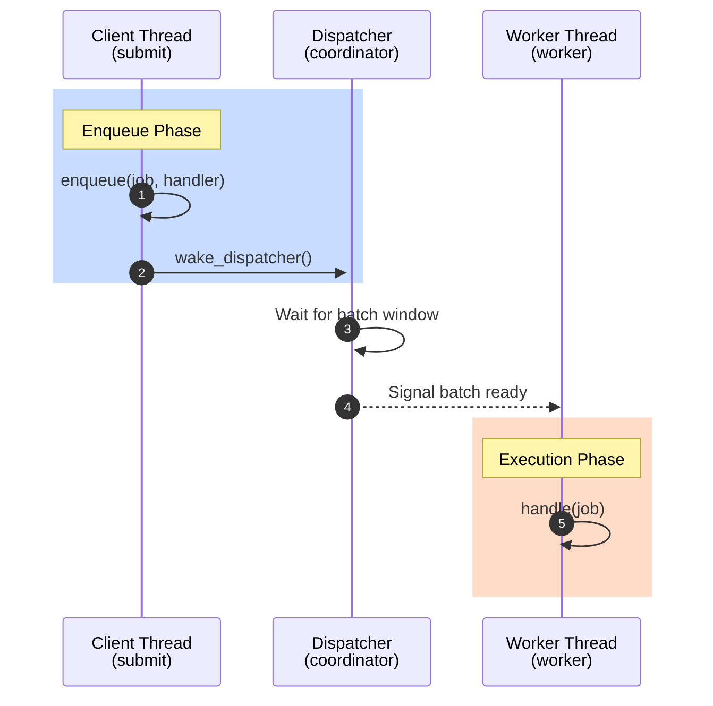
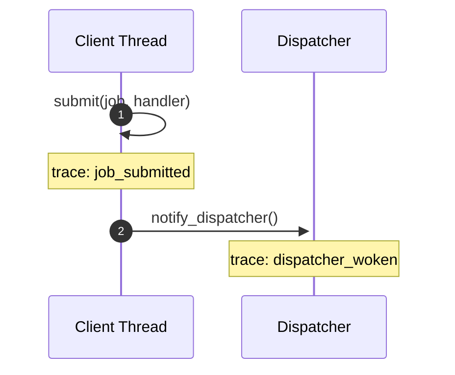
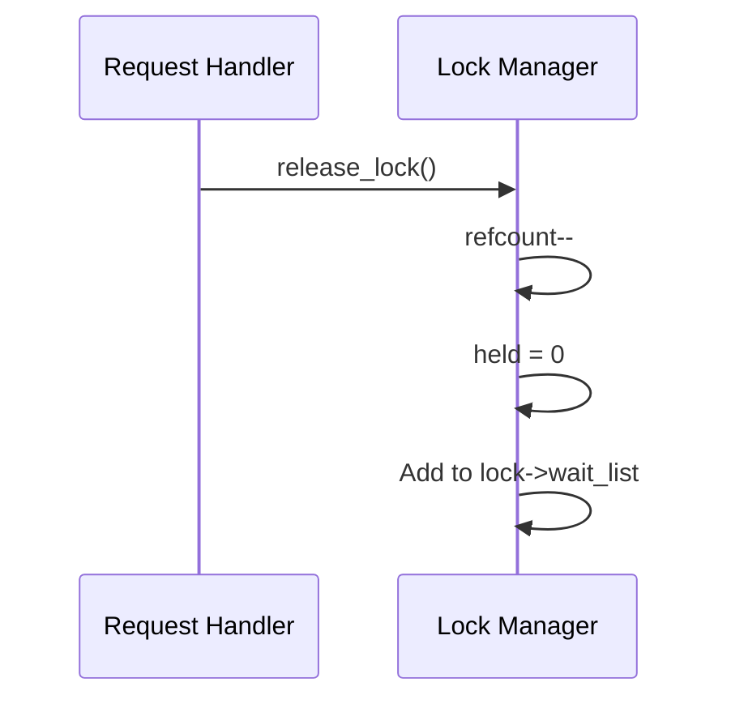
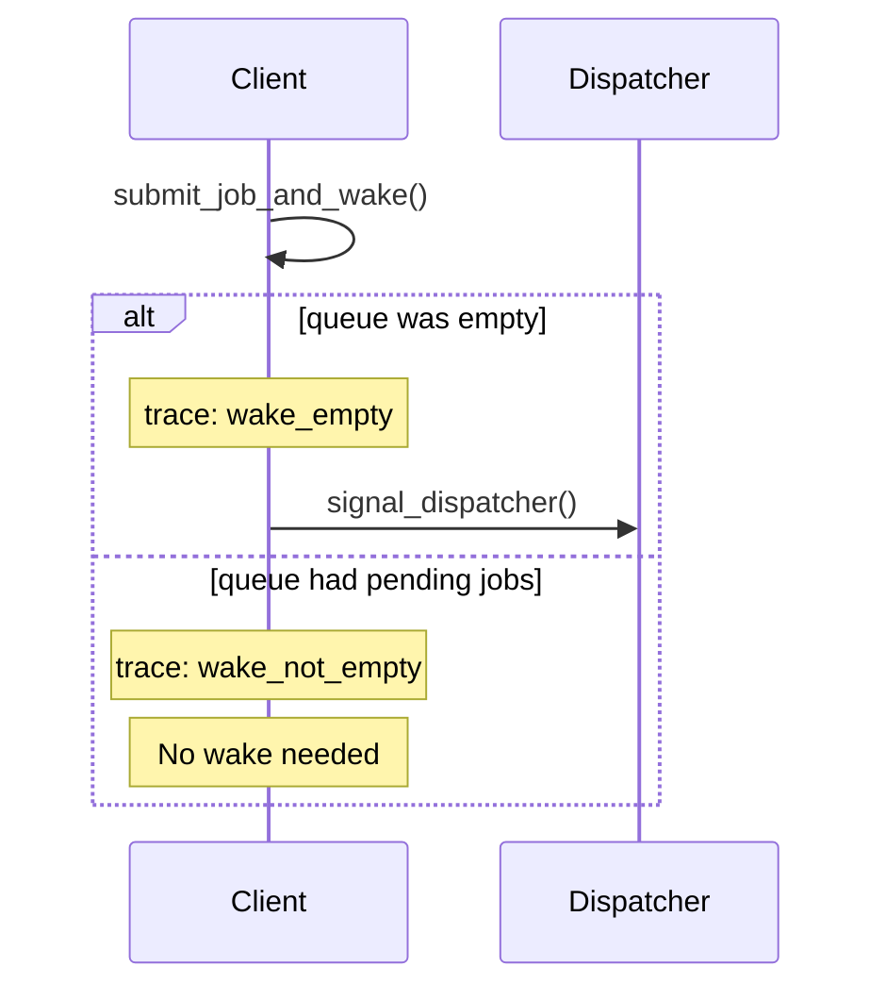
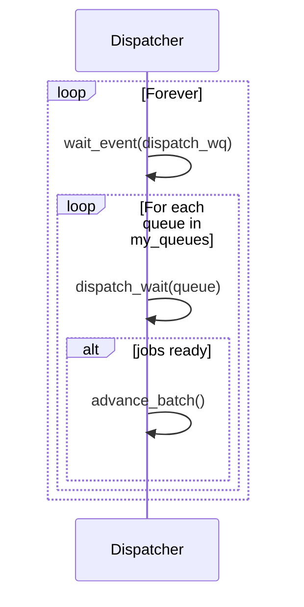
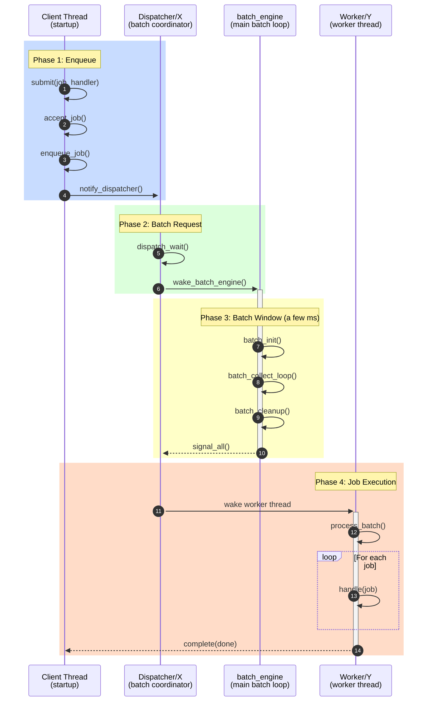
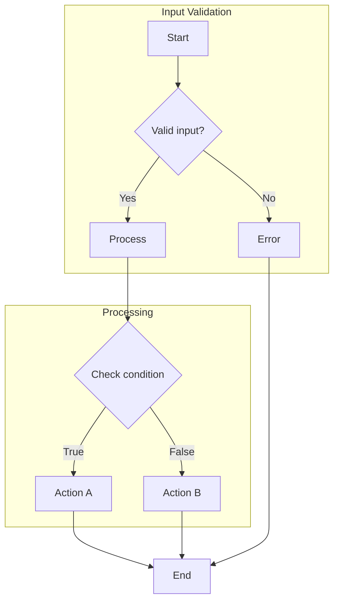
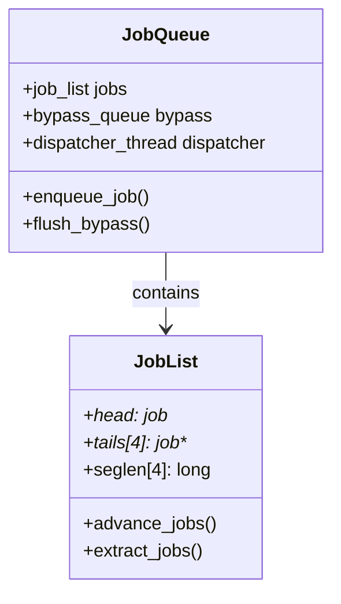

# Mermaid Sequence Diagrams for Code Flow

Best for: Function call sequences, inter-thread communication, lock flows, callback chains.

A picture speaks a thousand words. Sequence diagrams excel at showing **code flow** - the sequence of events between different objects or entities. They answer: "What calls what, in what order, and why?"

## Basic Code Flow Example

## Advanced Code Flow Techniques (advanced)

### 1. Trace Event Annotations

Embed actual tracepoint names inline:

### 2. State Variable Changes

Show state variable mutations:

### 3. Conditional Paths with alt/else

### 4. Daemon Loop Patterns

### 5. Multi-Thread Lifecycle (Complete Example)

## Color Conventions

| Color | RGB | Use For |
|-------|-----|---------|
| Blue | `rgb(200, 220, 255)` | Entry/enqueue phases |
| Green | `rgb(220, 255, 220)` | Processing phases |
| Yellow | `rgb(255, 255, 200)` | Wait/deferral periods |
| Orange | `rgb(255, 220, 200)` | Execution/completion |
| Red | `rgb(255, 200, 200)` | Interrupt/signal events |

## Syntax Reference

| Feature | Syntax | Description |
|---------|--------|-------------|
| Autonumber | `autonumber` | Auto step numbers |
| Colored region | `rect rgb(R, G, B)` | Phase highlighting |
| Rich participant | `participant X as Label subtitle` | Multi-line names |
| Solid arrow | `->>` | Synchronous call |
| Dashed arrow | `-->>` | Response/async |
| Activate | `+` after arrow | Start lifeline |
| Deactivate | `-` after arrow | End lifeline |
| Conditional | `alt/else/end` | Branch paths |
| Loop | `loop Label` | Iteration |
| Note | `Note over X: text` | Annotation |

## Flowcharts (Graph Diagrams)

Best for: Decision trees, control flow, algorithm visualization.

**Direction options:** `TD` (top-down), `LR` (left-right), `BT` (bottom-top), `RL` (right-left)

**Node shapes:**
- `[text]` - Rectangle
- `(text)` - Rounded rectangle
- `{text}` - Diamond (decision)
- `((text))` - Circle
- `[[text]]` - Subroutine
- `[(text)]` - Cylinder (database)

## Class Diagrams

Best for: Struct relationships, API interfaces, component dependencies.

