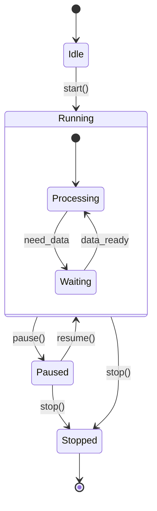
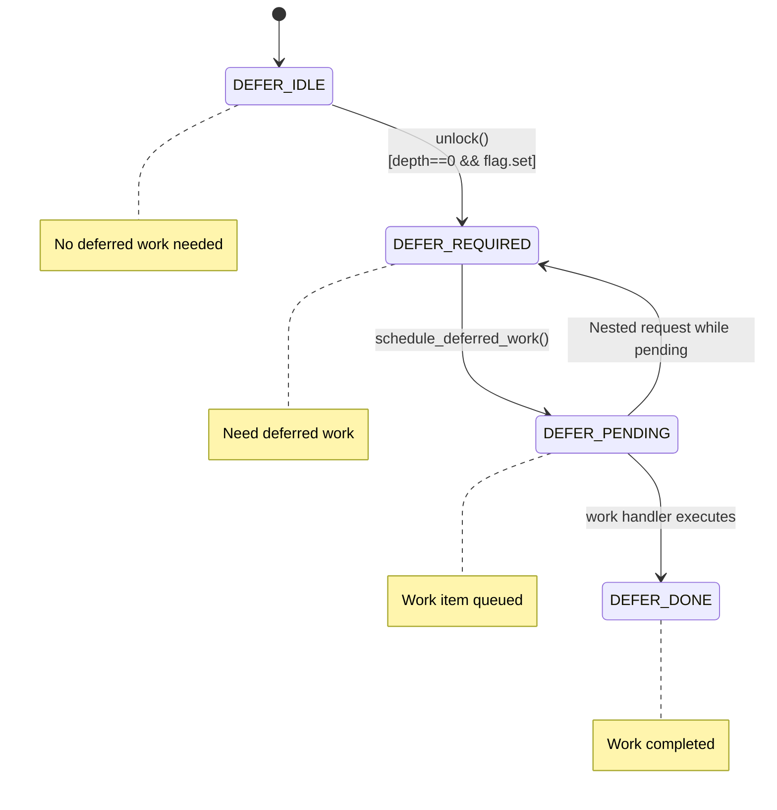

# Finite State Machines for State Understanding

Best for: Understanding system state at different points in time, which events can occur in which states, lifecycle management.

FSMs answer: "What state is the system in? What events can happen here? What triggers transitions?"

## Basic State Machine (Mermaid)



## Advanced FSM Patterns (advanced)

### 1. Service Startup Sequential State Machine

Shows service startup phases with multiple tracking variables:

```
Service Start
    |
    v
+-----------------------------+
| service_active = 0          |  <-- STOPPED
| init_invoked = false        |
+-----------------------------+
    |
    v  service_init()
+-----------------------------+
| service_active = 0          |  <-- Still STOPPED
| init_invoked = true         |
+-----------------------------+
    |
    v  service_starting()
+-----------------------------+
| service_active = 1          |  <-- STARTING
+-----------------------------+
    |
    v  service_set_runtime_mode()
+-----------------------------+
| service_active = 2          |  <-- RUNNING
+-----------------------------+
```

### 2. Progressive Escalation FSM

Timeout-based state progression (common for health-checking an unresponsive component):

```
+---------------------------------------------------------------+
|          Progressive Urgency Escalation                       |
+---------------------------------------------------------------+

Level 1: Check for recovery (immediate)
+-------------------------------------------+
| if (health_check_recovered_since())       |
|     return 1; // component recovered      |
+-------------------------------------------+
                    |
                    v  (after 2 * check_interval)
Level 2: Set warning flags
+-------------------------------------------+
| WRITE_ONCE(node->need_deep_check, true);  |
| store_release(&node->urgent_check,        |
|               true);                      |
+-------------------------------------------+
                    |
                    v  (after 3 * check_interval, still unhealthy)
Level 3: Force restart
+-------------------------------------------+
| WRITE_ONCE(node->urgent_check, true);     |
| return -1; // Signal for force_restart()  |
+-------------------------------------------+
```

### 3. Multi-Flag State Encoding

Bit fields for atomic operations:

```
+---------------------------------------------------------------+
|             Connection/Session State Encoding                  |
+---------------------------------------------------------------+

  Bit Layout:  [ACTIVE_BIT]        [STATE_BITS]
                     |                  |
               +-----------+      +-----------+
               |  Bit 2    |      |  Bits 0-1 |
               | Active    |      | Session   |
               +-----------+      +-----------+

  States:
  * SESSION_CONNECTED     = 0
  * SESSION_IDLE          = 1
  * SESSION_AUTHENTICATED = 2
  * SESSION_CLOSING       = 3
  * SESSION_ACTIVE        = 4 (separate bit!)

  Design: Odd values = active/tracking, Even = inactive
+---------------------------------------------------------------+
```

### 4. Deferred Work State Machine with Guard Conditions



### 5. Job Queue State Machine (ASCII for docs)

```
                    +------------------+
                    |   Queue Empty    |
                    | (was_alldone=T)  |
                    +--------+---------+
                             |
                    [First job enqueued]
                             |
                             v
                    +------------------+
                    | Wake dispatcher  |
                    | (WAKE or LAZY)   |
                    +--------+---------+
                             |
                    [dispatcher processing]
                             |
                             v
                    +------------------+
                    | Queue Non-Empty  |
                    | (was_alldone=F)  |
                    +--------+---------+
                             |
            +----------------+----------------+
            |                                 |
       [More jobs]                    [Jobs exhausted]
            |                                 |
            v                                 v
    +------------------+            +------------------+
    | Overload Check   |            | Back to Empty    |
    | len > high_mark? |            +------------------+
    +--------+---------+
```

### 6. Dependency Hierarchy FSM

Shows blocking relationships:

```
Global Timer Dependency         (global_dep_mask)
         |
         | blocks
         v
Per-Worker Timer Dependency     (worker->dep_mask)
         |
         | blocks
         v
Per-Task Timer Dependency       (task->dep_mask)
         |
         | blocks
         v
Per-Session Timer Dependency    (task->session->dep_mask)

Note: Higher levels block lower levels from stopping the timer.
```

## FSM Design Patterns

| Pattern | Use Case | Example |
|---------|----------|---------|
| Sequential Boot | Initialization phases | Service startup phases |
| Progressive Escalation | Timeout-based urgency | Health-check escalation levels |
| Multi-Flag Encoding | Atomic state updates | Connection/session bits |
| Guard Conditions | Conditional transitions | Deferred work states |
| Dependency Hierarchy | Blocking relationships | Timer dependencies |

## Key FSM Techniques

1. **Show what events can occur in each state** - Not all transitions are valid from all states.
2. **Include guard conditions** - `[condition]` syntax shows when transitions are allowed.
3. **Document entry/exit actions** - What happens when entering or leaving a state.
4. **Use timeout-based escalation** - For systems that progressively increase urgency.
5. **Show multi-flag relationships** - When state is encoded in multiple variables.

## ASCII State Machine Template

```
                    +------------------+
                    |      IDLE        |
                    +--------+---------+
                             |
                    [event: start]
                             |
                             v
                    +------------------+
                    |     RUNNING      |<--------+
                    +--------+---------+         |
                             |                   |
            +----------------+----------------+  |
            |                                 |  |
     [event: pause]                   [event: resume]
            |                                 |  |
            v                                 |  |
    +------------------+                      |  |
    |     PAUSED       |----------------------+  |
    +--------+---------+                         |
             |                                   |
      [event: stop]                              |
             |                                   |
             v                                   |
    +------------------+                         |
    |     STOPPED      |-------------------------+
    +------------------+       [event: restart]
```
